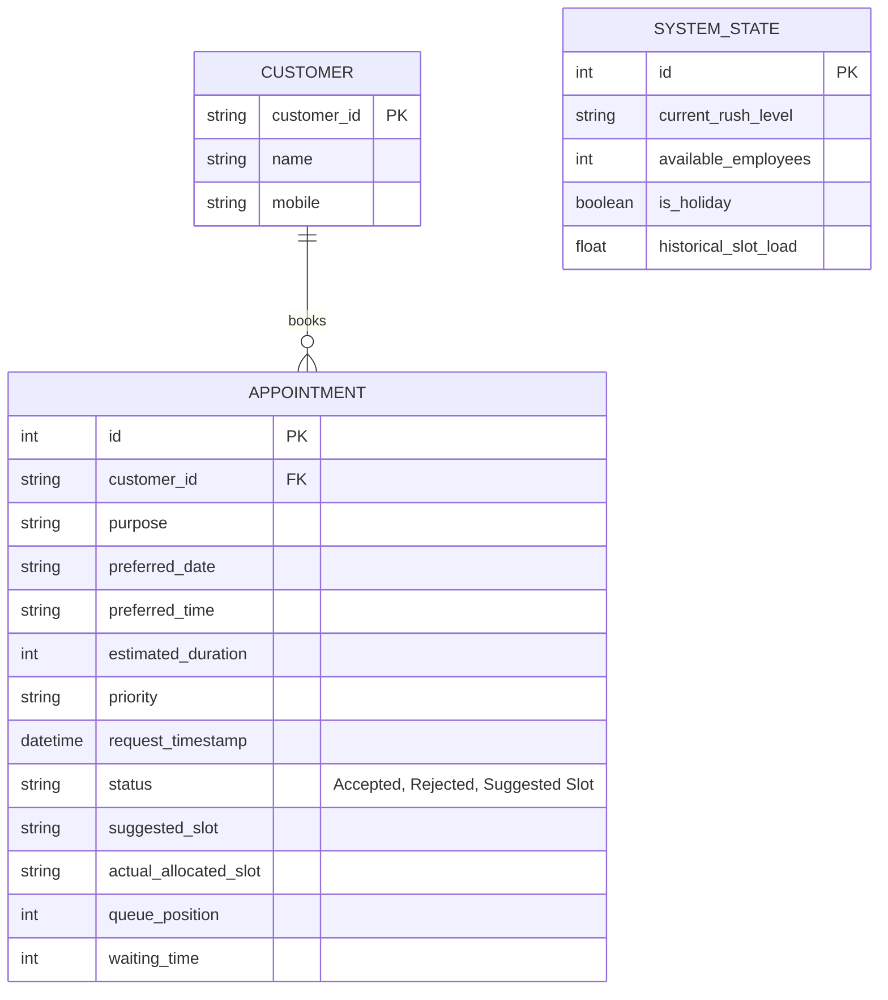

# AI-Based Smart Bank Appointment System

## ER Diagram (Mermaid)

```mermaid
erDiagram
    CUSTOMER {
        string customer_id PK
        string name
        string mobile
    }
    APPOINTMENT {
        int id PK
        string customer_id FK
        string purpose
        string preferred_date
        string preferred_time
        int estimated_duration
        string priority
        datetime request_timestamp
        string status "Accepted, Rejected, Suggested Slot"
        string suggested_slot
        string actual_allocated_slot
        int queue_position
        int waiting_time
    }
    SYSTEM_STATE {
        int id PK
        string current_rush_level
        int available_employees
        boolean is_holiday
        float historical_slot_load
    }
    CUSTOMER ||--o{ APPOINTMENT : "books"
```
